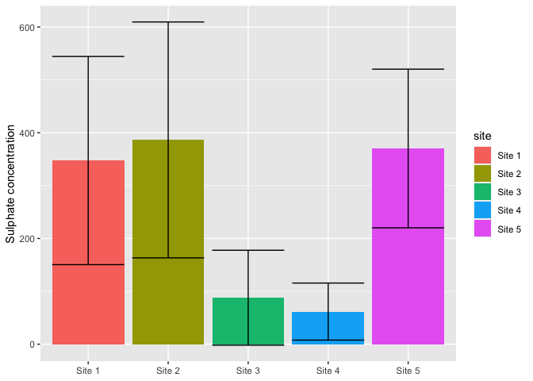
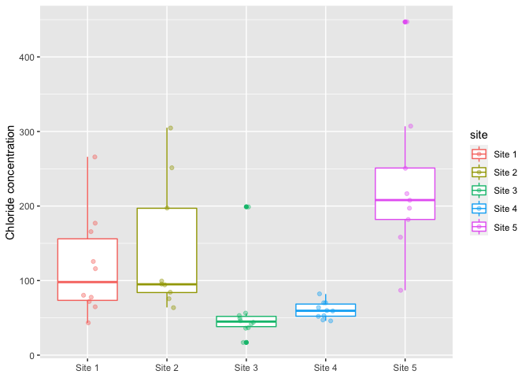
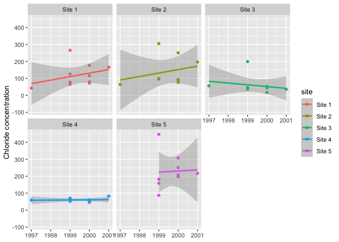

# Week 06 - Homework   Intro RMarkdown and {ggplot}

Welcome to your assignment for **week 6**. As usual, **Clone** this repo into your own :computer:  using RStudio, as we saw in class.

This week we will work with the **ditch data**[1](https://www.springer.com/gp/book/9780387459677) that we saw in class. This data consists of series of water quality measures for a number of sites (ditches) colected over a number of years and at various depths.

For this week's assignment you will need to create a short **"report" in an RMarkdown** format with its associated `.md` and `.html` outputs (i.e. you will need to *knit it* at the end). In this report you will guide me through the process of replicating the following items. Feel free to add as much text as you want explaining your steps.

## Item 1

A **summary table** showing the mean and standard deviation values for sulphate in each site. You can use the table below for reference.

|site   |parameter | mean_measure| sd_measure|
|:------|:---------|------------:|----------:|
|Site 1 |sulphate  |       347.40|     196.93|
|Site 2 |sulphate  |       386.44|     223.15|
|Site 3 |sulphate  |        87.90|      89.80|
|Site 4 |sulphate  |        61.70|      53.98|
|Site 5 |sulphate  |       370.22|     150.09|

## Item 2

The following figure showing the sulphate summary data from the previous table.

<!-- -->

## Item 2

The following figure summarizing the chloride concentrations in each of the sites.

<!-- -->

## Item 2

The following figure showing temporal trends in the concentrations of chloride for each of the sites.

<!-- -->

## wrap-up

In addition to being shown in the final report, each figure should be saved in `.pdf` format with a width of 190 mm

Finally, once you have completed the exercises, as usual:

- Once you are done with the R markdown file, save the changes, and make sure it is properly saved in a folder named **Rmarkdown**.
- Commit all the changes to the *repo/R project* (remember to write a commit mesage!)
- **Push** all changes back to **GitHub**
- Go to GitHub and check that it all worked out

## A few hints

- Make sure to save your `.rmd` file in the rmarkdown folder
- You will need to use the **{here}** package to correctly load the ditch data into the `.Rmd` file as well as to save the figures.

As always, feel free to use [the Issues](https://github.com/UM-R-for-EnvSci-Registered-Student-2021/General_Discussion/issues) section of the of [General Discussion](https://github.com/UM-R-for-EnvSci-Registered-Student-2021/General_Discussion) repo to ask any questions you might have or to share anny issues you come across. 

Note for those of you **still waiting for a final Git/GitHub set up**. You can still use the green button labelled "code" to download a zip version of the repository. You can unzip this anywhere in your computer and open the R project by double clicking the blue cube .RProj file. then you will be able to work on the project, edit and save like you would on any other R project.The only difference, for now, is that you will not be able to "push" the changes back to github, as that folder is not being tracked by Git/GitHub. We will need to find a separate solution for you to get this folder back to me once you are done with the asignment (e.g. zip eail attachment or dropbox/google drive/onedrive link)

*Happy coding!*

Pepe

