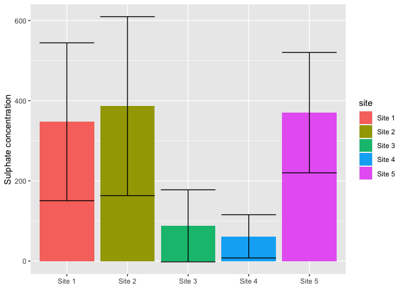
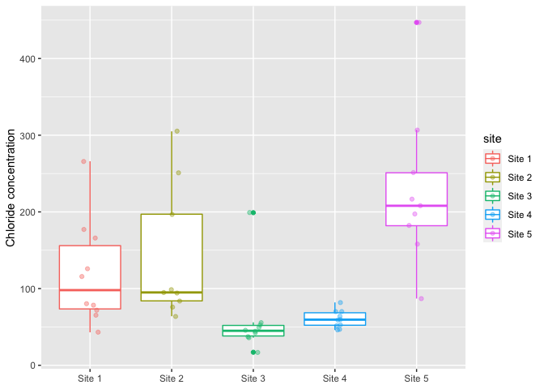
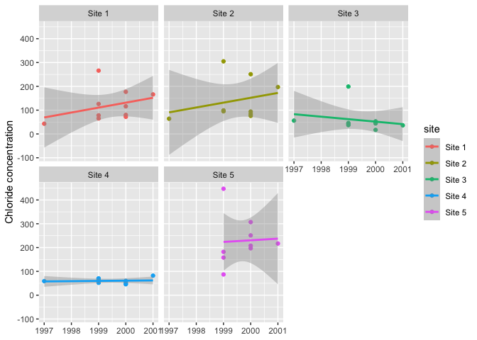

# Load data

We are going to load the required dataset of water quality measured in ditches. 


```r
dat_original <- read_csv(here("data", "ditch.csv"))
```

```
## Rows: 48 Columns: 18
```

```
## ── Column specification ────────────────────────────────────────────────────────
## Delimiter: ","
## chr  (1): Site
## dbl (17): Year, Month, Depth, pH, Conductivity, BOD, Ammoniacal_Nitrogen, To...
```

```
## 
## ℹ Use `spec()` to retrieve the full column specification for this data.
## ℹ Specify the column types or set `show_col_types = FALSE` to quiet this message.
```
# Data processing
 
 Let's clean the names so they fit within the tydiverse style guide
 

```r
dat <- dat_original %>% 
  clean_names()

dat
```

```
## # A tibble: 48 × 18
##    site    year month depth   p_h conductivity   bod ammoniacal_nitrogen
##    <chr>  <dbl> <dbl> <dbl> <dbl>        <dbl> <dbl>               <dbl>
##  1 Site 1  1997    11 NA     7.62          511   7.1                 0.1
##  2 Site 1  1999     1  0.4   8.51          778   7.9                 0.2
##  3 Site 1  1999     4  0.25  7.71          517   3.6                 0.1
##  4 Site 1  1999     7  0.4   7.77         1892   3.4                 0.1
##  5 Site 1  1999    10  0.5   8.04         1600   4.2                 1.2
##  6 Site 1  2000     1  0.2   8.06          889   4.5                 0.8
##  7 Site 1  2000     4  0.75  7.72         1010   2                   0.1
##  8 Site 1  2000     7  0.1   7.94         1460   5.5                 0.3
##  9 Site 1  2000    10  0.75  7.21         1050   3.1                 0.6
## 10 Site 1  2001     1  0.1   7.7          1760  14                   3.4
## # … with 38 more rows, and 10 more variables: total_oxidised_nitrogen <dbl>,
## #   suspended_solids <dbl>, chloride <dbl>, sulphate <dbl>,
## #   total_calcium <dbl>, total_zinc <dbl>, total_cadmium <dbl>,
## #   total_lead <dbl>, total_nickel <dbl>, total_phosphate <dbl>
```
 
# Data summary
 

```r
sulphate_summary <- dat %>% 
  pivot_longer(cols = c(-site, -year, -month, -depth), names_to = "parameter", values_to = "measure") %>% 
  filter(parameter == "sulphate") %>% 
  group_by(site, parameter) %>% 
  summarise(mean_measure = mean(measure, na.rm = TRUE),
            sd_measure = sd(measure, na.rm = TRUE)) %>% 
  mutate(mean_measure = round(mean_measure, digits = 2),
         sd_measure = round(sd_measure, digits = 2))
```

```
## `summarise()` has grouped output by 'site'. You can override using the `.groups` argument.
```

This following chunk is not required for the assignment, but it formats the table so it looked pretty in the `README.md`


|site   |parameter | mean_measure| sd_measure|
|:------|:---------|------------:|----------:|
|Site 1 |sulphate  |       347.40|     196.93|
|Site 2 |sulphate  |       386.44|     223.15|
|Site 3 |sulphate  |        87.90|      89.80|
|Site 4 |sulphate  |        61.70|      53.98|
|Site 5 |sulphate  |       370.22|     150.09|


# Plots

## Bar chart

We will use the generated summary table to create the following bar chart


```r
bar_chart <- sulphate_summary %>% 
  ggplot() +
  geom_col(aes(x = site, y = mean_measure, fill = site)) +
  geom_errorbar(aes(x = site, ymin = mean_measure - sd_measure, ymax = mean_measure + sd_measure)) +
  labs(x = NULL,
       y = "Sulphate concentration")

bar_chart
```

<!-- -->

Let's save it:


```r
ggsave(here("figures", "bar_chart.pdf"), bar_chart, width = 190, height = 120, units = "mm")
```


## Box plot
 
 Now lets look at the chloride concentrations between sites
 

```r
box_plot <- dat %>% 
  pivot_longer(cols = c(-site, -year, -month, -depth), names_to = "parameter", values_to = "measure") %>% 
  filter(parameter == "chloride") %>% 
  ggplot() +
  geom_boxplot(aes(x = site, y = measure, colour = site)) +
  geom_jitter(aes(x = site, y = measure, colour = site), width = 0.1, alpha = 0.4) +
  labs(x = NULL,
       y = "Chloride concentration")

box_plot
```

<!-- -->

Let's save it:


```r
ggsave(here("figures", "box_plot.pdf"), box_plot, width = 190, height = 120, units = "mm")
```


## Temporal points plot
 

```r
temp_plot <- dat %>% 
  pivot_longer(cols = c(-site, -year, -month, -depth), names_to = "parameter", values_to = "measure") %>% 
  filter(parameter == "chloride") %>% 
  ggplot() +
  facet_wrap(~site) +
  geom_point(aes(x = year, y = measure, colour = site)) +
  geom_smooth(aes(x = year, y = measure, colour = site), method = "lm") +
  labs(x = NULL,
       y = "Chloride concentration")

temp_plot
```

```
## `geom_smooth()` using formula 'y ~ x'
```

<!-- -->

Let's save it:


```r
ggsave(here("figures", "temp_plot.pdf"), temp_plot, width = 190, height = 120, units = "mm")
```

```
## `geom_smooth()` using formula 'y ~ x'
```

 
 

